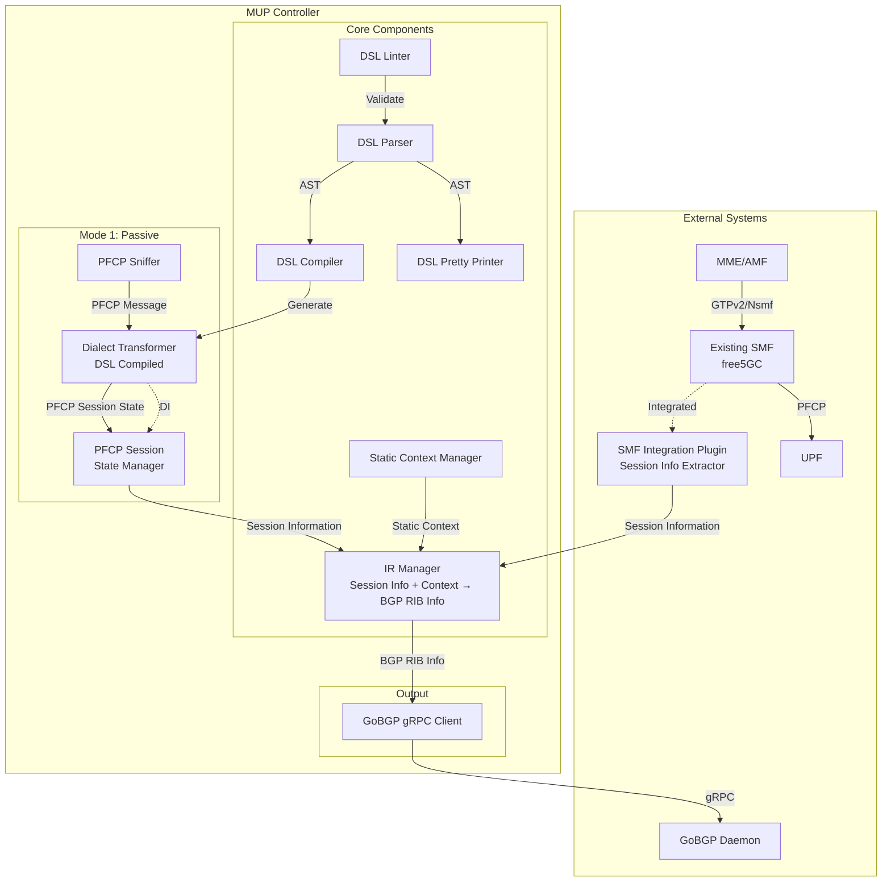
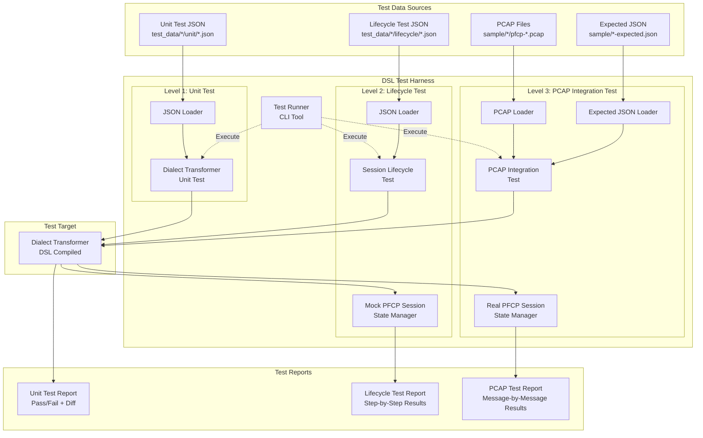

# SRv6 MUP Controller 設計書

## Overview

SRv6 MUP Controllerは、モバイルネットワークのセッション情報（Session Information / IR）を収集し、静的コンテクストと合成してSRv6 MUP（Mobile User Plane）のルーティング情報としてGoBGPに配信するシステムである。本システムは、PFCP方言の差異を吸収するSession InformationとDSL（Domain Specific Language）を中核として、柔軟な拡張性と保守性を実現する。

### システムの目的

- モバイルネットワークのセッション情報をSRv6ネットワークに統合
- 異なるベンダーのPFCP実装（PFCP方言）に対応（Mode-1）
- 既存SMF実装との統合によるセッション情報収集（Mode-2）
- 既存ネットワークへの影響を最小化（パッシブモード）

### 主要な特徴

1. **デュアルモード動作**: パッシブモード（Mode 1）とアクティブモード（Mode 2）の両方をサポート
2. **PFCP方言対応**: DSLによる柔軟な変換ロジック記述（Mode-1専用）
3. **Session Information（IR）**: PFCP方言とSMF実装の差異を吸収する統一データモデル
4. **GoBGP連携**: MUP SAFI RIBへのルート配信
5. **静的コンテクスト管理**: JSON設定によるネットワーク構成管理

### 実装言語とデプロイ形態

- **実装言語**: Go
- **デプロイ形態**: スタンドアロンバイナリ（将来的にコンテナ化）
- **依存関係**: GoBGP（gRPC経由で連携）


## Architecture

### システムアーキテクチャ図



### DSL Test Harness アーキテクチャ図



### データフロー

#### 用語の定義

- **Session Information（IR）**: セッション情報の統一表現（UE IP、TEID、QFI、Endpoint、Network Instance等）。PFCPやSMF内部データから抽出される
- **Static Context**: JSON設定から取得した静的情報（RD、RT、MUP Extended Community、Source Address、Nexthop等）
- **BGP RIB Info**: Session Information + Static Context を IR Manager が合成した結果。GoBGP MUP SAFI RIBに必要な全ての情報を含む

#### Mode 1（パッシブモード）のデータフロー

1. **PFCP受信**: SMF-UPF間のPFCPトラフィックをスニッフィング
2. **Dialect変換**: PFCP方言 → Dialect Transformer → PFCP Session State差分
3. **ステート管理**: PFCP Session State Manager がセッションライフサイクルを管理
   - Establishment: 新規セッション状態を作成
   - Modification: 既存セッション状態を更新（差分マージ）
   - Deletion: セッション状態を削除
4. **Session Information生成**: PFCP Session State → Dialect Transformer → Session Information
5. **BGP RIB Info生成**: Session Information + Static Context → BGP RIB Info（IR Managerで合成）
6. **BGP配信**: BGP RIB Info → GoBGP gRPC Client → MUP SAFI RIB

#### Mode 2（アクティブモード）のデータフロー

**既存SMF実装との連携**:
1. **SMF処理**: AMF/MME → GTPv2/Nsmf API → free5GC SMF → PFCP → UPF
2. **プラグイン抽出**: free5GC SMF → SMF Integration Plugin（gRPC push） → Session Information
3. **BGP RIB Info生成**: Session Information + Static Context → BGP RIB Info（IR Managerで合成）
4. **BGP配信**: BGP RIB Info → GoBGP gRPC Client → MUP SAFI RIB

**注**: Mode-2では、free5GC SMFがGTPv2/Nsmf APIの処理、UE IP割り当て、UPF選択、PFCP通信等の全てのSMF機能を担当する。4G（GTPv2 S5-C）と5G（Nsmf REST）の制御プロトコルの違いはfree5GC内部で吸収される。MUP Controllerは、SMF Integration Plugin経由でgRPC pushされたSession Informationを受信するのみ。DSLはMode-1専用であり、Mode-2では使用しない。


## Components and Interfaces

### Mode 1: PFCP Sniffer

**責務**:
- SMF-UPF間のPFCPトラフィックをキャプチャ
- PFCPパケットをパススルー（通信に影響を与えない）
- キャプチャしたPFCPメッセージをDialect Transformerに渡す

**実装方針**:
- libpcapまたはgopacketを使用したパケットキャプチャ
- PFCPメッセージタイプの識別（Session Establishment/Modification/Deletion）
- 非ブロッキングI/Oによる高速処理

**インターフェース**:
```go
type PFCPSniffer interface {
    Start(ctx context.Context, config SnifferConfig) error
    Stop() error
    OnPFCPMessage(handler func(msg *PFCPMessage) error)
}
```

### Dialect Transformer

**責務**:
- PFCP方言固有のデータ抽出とマッピング
- PFCPメッセージ → PFCP Session State差分への変換
- PFCP Session State → Session Informationへの変換

**実装方針**:
- DSLコンパイラによって生成されたGoコード
- ビルド時にコンパイルされるため実行時オーバーヘッドなし
- 各PFCP方言ごとに独立した実装
- Dependency Injectionパターンで注入

**インターフェース**:
```go
// DSLコンパイラによって生成される
type DialectTransformer interface {
    // PFCPメッセージ → PFCP Session State差分
    EstablishmentToState(pfcp *PFCPEstablishmentRequest) (*PFCPSessionState, error)
    ModificationToState(pfcp *PFCPModificationRequest) (*PFCPSessionStateDelta, error)
    
    // PFCP Session State → Session Information（単一出力: 互換）
    StateToSessionInfo(state *PFCPSessionState) (*SessionInformation, error)
    // PFCP Session State → Session Information（複数Route Instance対応）
    StateToSessionInfos(state *PFCPSessionState) ([]*SessionInformation, error)
    
    // 方言名を返す
    Name() string
}

// PFCP Session State（セッションの現在状態）
type PFCPSessionState struct {
    SEID         uint64
    PDRs         map[uint16]*PDR  // PDR ID → PDR
    FARs         map[uint32]*FAR  // FAR ID → FAR
    QERs         map[uint32]*QER  // QER ID → QER
    LastModified time.Time
}

// PFCP Session State Delta（Modificationの差分）
type PFCPSessionStateDelta struct {
    SEID         uint64
    UpdatePDRs   map[uint16]*PDR
    RemovePDRs   []uint16
    UpdateFARs   map[uint32]*FAR
    RemoveFARs   []uint32
    UpdateQERs   map[uint32]*QER
    RemoveQERs   []uint32
}
```

### PFCP Session State Manager

**責務**:
- PFCPセッションのライフサイクル管理（Establishment → Modification → Deletion）
- セッション状態の保持と更新
- Modificationメッセージの差分を既存ステートにマージ
- 完全なSession Informationの生成
- CP SEIDとUP SEIDの名寄せ（SEIDエイリアス）の管理

**実装方針**:
- インメモリストレージ（将来的に永続化対応）
- SEIDをキーとしたマップ構造
- スレッドセーフな操作（sync.RWMutex）
- Dialect TransformerをDIで注入
- Establishment ResponseのヘッダSEID（CP）とF-SEID（UP）を対応付け、以後のModification/Deletionで正規化SEIDを使用する

**インターフェース**:
```go
type PFCPSessionStateManager interface {
    // Establishmentメッセージを処理
    HandleEstablishment(pfcp *PFCPEstablishmentRequest) ([]*SessionInformation, error)
    
    // Modificationメッセージを処理（差分をマージ）
    HandleModification(pfcp *PFCPModificationRequest) ([]*SessionInformation, error)
    
    // Deletionメッセージを処理
    HandleDeletion(pfcp *PFCPDeletionRequest) error

    // SEIDを正規化（UP SEID → CP SEID）
    CanonicalSEID(seid uint64) uint64
    
    // セッション状態を取得
    GetState(seid uint64) (*PFCPSessionState, error)
    
    // 全セッション状態をリスト
    ListStates() ([]*PFCPSessionState, error)
}

// コンストラクタ（DIで方言を注入）
func NewPFCPSessionStateManager(transformer DialectTransformer) PFCPSessionStateManager
```

### Mode 2: SMF Integration Plugin

**責務**:
- free5GC SMFからSession Informationを抽出
- Session InformationをMUP ControllerのIR Managerに送信（gRPC push）
- free5GC SMFの内部処理に影響を与えない

**実装方針**:
- free5GC SMFのコードベースに統合するGoプラグイン形式
- SMFのセッション確立/更新/削除時にフックして情報を抽出
- gRPC pushでMUP Controllerに非同期送信（SMFの処理をブロックしない）
- 制御プロトコル（Nsmf REST / GTPv2 S5-C）はfree5GC内部で処理済み、プラグインはセッションコンテキストのみを参照

**対応SMF実装**:
- free5GC: Go言語実装、`smf/context/`のセッションコンテキストフックを活用

**インターフェース**:
```go
// MUP Controller側のAPI（プラグインから呼ばれる）
type SessionInfoReceiver interface {
    // プラグインからSession Informationを受信
    ReceiveSessionInfo(ctx context.Context, sessionInfo *SessionInformation) error
}

// プラグイン側の実装（各SMFに統合）
type SMFPlugin interface {
    // SMFのセッション確立時に呼ばれる
    OnSessionEstablished(session SMFSession) error
    
    // SMFのセッション更新時に呼ばれる
    OnSessionModified(session SMFSession) error
    
    // SMFのセッション削除時に呼ばれる
    OnSessionDeleted(sessionID string) error
    
    // Session InformationをMUP Controllerに送信
    SendToMUPController(sessionInfo *SessionInformation) error
}
```

**プラグイン設定例**:
```json
{
  "smf_plugin": {
    "enabled": true,
    "mup_controller_address": "localhost:50052",
    "protocol": "grpc",
    "async": true,
    "retry": {
      "max_attempts": 3,
      "backoff": "exponential"
    }
  }
}
```


### DSL Compiler

**責務**:
- DSL定義ファイルをパースしてAST（抽象構文木）を生成
- ASTからDialect TransformerのGoコード実装を生成
- 生成されたコードをビルドシステムに統合

**実装方針**:
- 字句解析器（Lexer）と構文解析器（Parser）の実装
- ASTからGoコードへのコード生成
- テンプレートエンジン（text/template）を使用したコード生成

**インターフェース**:
```go
type DSLCompiler interface {
    Compile(dslFile string) (*GeneratedCode, error)
    GenerateGoCode(ast *DSLAst) (string, error)
}

type GeneratedCode struct {
    TransformerImpl string // Dialect Transformer実装のGoコード
    DialectName     string
}
```

### DSL Test Harness

**責務**:
- DSLコンパイル済みDialect Transformerの3レベルテスト
- レベル1: Dialect Transformer単体テスト
- レベル2: セッションライフサイクルテスト
- レベル3: PCAP統合テスト

**実装方針**:
- 各レベルで独立したテストインターフェース
- JSON形式のテストデータ管理
- 差分検出とレポート生成
- CI/CDパイプラインへの統合

**インターフェース**:

```go
// レベル1: Dialect Transformer単体テスト
type DialectTransformerUnitTest interface {
    // Establishment変換のテスト
    TestEstablishment(input *PFCPEstablishmentRequest, expectedState *PFCPSessionState) error
    
    // Modification変換のテスト
    TestModification(input *PFCPModificationRequest, expectedDelta *PFCPSessionStateDelta) error
    
    // State → SessionInfo変換のテスト
    TestStateToSessionInfo(inputState *PFCPSessionState, expectedSessionInfo *SessionInformation) error
    
    // JSONテストデータから実行
    RunFromJSON(testDataFile string) (*UnitTestReport, error)
}

type UnitTestReport struct {
    TotalTests  int
    PassedTests int
    FailedTests int
    Failures    []UnitTestFailure
}

type UnitTestFailure struct {
    TestName string
    Expected interface{}
    Actual   interface{}
    Diff     string
}

// レベル2: セッションライフサイクルテスト
type SessionLifecycleTest interface {
    // 一連のPFCPメッセージでセッションライフサイクルをテスト
    TestLifecycle(messages []PFCPMessageWithExpectation) (*LifecycleTestReport, error)
    
    // JSONテストデータから実行
    RunFromJSON(testDataFile string) (*LifecycleTestReport, error)
}

type PFCPMessageWithExpectation struct {
    Type                string // "establishment", "modification", "deletion"
    Message             *PFCPMessage
    ExpectedSessionInfo *SessionInformation // deletionの場合はnil
}

type LifecycleTestReport struct {
    TotalSteps  int
    PassedSteps int
    FailedSteps int
    Failures    []LifecycleTestFailure
}

type LifecycleTestFailure struct {
    StepIndex int
    StepType  string
    Expected  *SessionInformation
    Actual    *SessionInformation
    Diff      string
}

// レベル3: PCAP統合テスト
type PCAPIntegrationTest interface {
    // PCAPファイルからPFCPメッセージを抽出
    LoadPCAP(pcapFile string) ([]*PFCPMessage, error)
    
    // JSON期待値を読み込み
    LoadExpectedJSON(jsonFile string) ([]*SessionInformation, error)
    
    // PCAP統合テストを実行
    TestFromPCAP(pcapFile string, expectedJSONFile string, transformer DialectTransformer) (*PCAPTestReport, error)
}

type PCAPTestReport struct {
    TotalMessages  int
    PassedMessages int
    FailedMessages int
    Failures       []PCAPTestFailure
}

type PCAPTestFailure struct {
    MessageIndex int
    MessageType  string
    Expected     *SessionInformation
    Actual       *SessionInformation
    Diff         string
}

// 統合テストハーネス
type DSLTestHarness interface {
    // 全レベルのテストを実行
    RunAllTests(dialectName string) (*AllTestsReport, error)
    
    // レベル別テストアクセス
    UnitTest() DialectTransformerUnitTest
    LifecycleTest() SessionLifecycleTest
    PCAPTest() PCAPIntegrationTest
}

type AllTestsReport struct {
    UnitTestReport      *UnitTestReport
    LifecycleTestReport *LifecycleTestReport
    PCAPTestReport      *PCAPTestReport
    OverallPassed       bool
}
```

**テストデータ構造例**:

```
test_data/
├── keysight_n9/
│   ├── unit/
│   │   ├── establishment_001.json
│   │   ├── modification_001.json
│   │   └── state_to_session_001.json
│   ├── lifecycle/
│   │   ├── session_lifecycle_001.json
│   │   └── session_lifecycle_002.json
│   └── pcap/
│       ├── pfcp-n9.pcap
│       └── pfcp-n9-expected.json
└── nokia/
    └── ...
```

### DSL Parser

**責務**:
- DSL定義ファイルを読み込んでASTを生成
- 構文エラーの検出と詳細なエラーメッセージの提供

**実装方針**:
- 再帰下降パーサーまたはパーサーコンビネータ
- エラーリカバリー機能
- 位置情報の保持（行番号、カラム番号）

**インターフェース**:
```go
type DSLParser interface {
    Parse(input string) (*DSLAst, error)
    ParseFile(filename string) (*DSLAst, error)
}

type DSLAst struct {
    DialectName string
    Mappings    []FieldMapping
    SourceInfo  SourceInfo
}

type FieldMapping struct {
    PFCPField   string
    IRField     string
    Transform   *TransformExpr
    Condition   *ConditionExpr
}
```

### DSL Pretty Printer

**責務**:
- ASTを整形されたDSL定義ファイルに変換
- 一貫したフォーマットの適用

**実装方針**:
- ASTのトラバース
- インデントとスペーシングの統一
- コメントの保持

**インターフェース**:
```go
type DSLPrettyPrinter interface {
    Print(ast *DSLAst) (string, error)
    PrintToFile(ast *DSLAst, filename string) error
}
```

### DSL Linter

**責務**:
- DSL定義ファイルの構文チェック
- ベストプラクティス違反の検出
- 問題の種類、位置、修正提案を含むレポート生成

**実装方針**:
- ASTベースの静的解析
- ルールベースのチェック
- 拡張可能なルールシステム

**インターフェース**:
```go
type DSLLinter interface {
    Lint(ast *DSLAst) (*LintReport, error)
    LintFile(filename string) (*LintReport, error)
}

type LintReport struct {
    Issues []LintIssue
}

type LintIssue struct {
    Severity    Severity // Error, Warning, Info
    Message     string
    Location    SourceLocation
    Suggestion  string
}
```


### IR Manager

**責務**:
- Session InformationとStatic Contextの合成によるBGP RIB Info生成
- BGP RIB Infoの管理とGoBGP Clientへの通知
- ルーティング情報の一時欠落（Endpoint/TEID消失）に対する保留削除（Grace Period）管理
  - 理由: PFCP Session Modificationにより旧FAR削除→新FAR作成が短時間で行われることがあり、その間Endpoint/TEIDが一時的に未確定となり得る

**実装方針**:
- インメモリストレージ（将来的に永続化対応）
- RouteKeyをキーとしたマップ構造（route_key = canonical_seid + far_id）
- スレッドセーフな操作（sync.RWMutex）
- BGP RIB Info生成時に必ずStatic Contextと合成
- Endpoint/TEID欠落時は即時DELETEせず、一定時間の猶予を設ける
- 猶予期間内に転送情報が復帰すればUPDATEとして扱う

**インターフェース**:
```go
type IRManager interface {
    // Session InformationとStatic ContextからBGP RIB Infoを生成・保存（Route Instance単位）
    CreateFromSession(routeKey string, sessionInfo *SessionInformation, staticCtx *StaticContext) (*BGPRIBInfo, error)
    
    // Session InformationとStatic ContextからBGP RIB Infoを更新
    UpdateFromSession(routeKey string, sessionInfo *SessionInformation, staticCtx *StaticContext) (*BGPRIBInfo, error)
    
    // BGP RIB Infoを削除
    Delete(routeKey string) error
    
    // BGP RIB Infoを取得（既に完全な状態）
    Get(routeKey string) (*BGPRIBInfo, error)
    
    // 全BGP RIB Infoをリスト
    List() ([]*BGPRIBInfo, error)

    // 保留削除の監視を開始
    StartPendingDeleteWatcher(ctx context.Context)
}

// Session Information（PFCPやSMF内部データから抽出）
type SessionInformation struct {
    RouteKey        string
    SessionID       string
    SEID            uint64
    FARID           uint32
    UEIPAddress     string
    UEPrefix        string
    TEID            uint32
    QFI             uint8
    EndpointAddress string
    NetworkInstance string
}
```

**保留削除（Grace Period）ロジック**:
- `EndpointAddress == ""` または `TEID == 0` の場合、RIB更新は行わず保留削除に遷移
- 保留削除タイマー満了で該当Route Instanceの `DELETE` を発行
- 期間内に転送情報が復帰した場合は保留削除を解除し `UPDATE` を発行

### Static Context Manager

**責務**:
- JSON設定ファイルから静的コンテクストを読み込み
- JSON Schemaによる設定ファイルの検証
- Network InstanceからRD/RT/その他属性へのマッピング提供

**実装方針**:
- JSON Schemaバリデーション（github.com/xeipuuv/gojsonschema）
- 設定ファイルの監視と再読み込み（将来実装）
- 設定のキャッシング

**インターフェース**:
```go
type StaticContextManager interface {
    Load(configFile string) error
    Validate(configFile string) error
    GetContext(networkInstance string) (*StaticContext, error)
    Reload() error
}

type StaticContext struct {
    NetworkInstance         string
    RD                      string
    RT                      []string
    SourceAddress           *string // Type 1用（optional）
    MUPExtendedCommunity    *MUPExtendedCommunity // Type 2用
    EndpointAddressLength   *int // Type 2用
    NexthopAddress          string
}

type MUPExtendedCommunity struct {
    SegmentIdentifier [6]byte
}
```

### GoBGP gRPC Client

**責務**:
- GoBGPとのgRPC通信
- MUP SAFI RIBへのルート追加/更新/削除
- Type 1/Type 2 Session Transformed Routeの生成

**実装方針**:
- GoBGP gRPC APIの使用
- コネクションプーリング
- リトライとエラーハンドリング

**インターフェース**:
```go
type GoBGPClient interface {
    Connect(address string) error
    Disconnect() error
    AddRoute(ribInfo *BGPRIBInfo) error
    UpdateRoute(ribInfo *BGPRIBInfo) error
    DeleteRoute(ribInfo *BGPRIBInfo) error
    GenerateType1Route(ribInfo *BGPRIBInfo) (*Type1SessionTransformedRoute, error)
    GenerateType2Route(ribInfo *BGPRIBInfo) (*Type2SessionTransformedRoute, error)
}

type Type1SessionTransformedRoute struct {
    RD              string
    RT              []string
    UEPrefix        string
    TEID            uint32
    QFI             uint8
    Endpoint        string
    SourceAddress   *string
    NexthopAddress  string
}

type Type2SessionTransformedRoute struct {
    RD                      string
    RT                      []string
    Endpoint                string
    TEID                    uint32
    MUPExtendedCommunity    MUPExtendedCommunity
    EndpointAddressLength   int
    NexthopAddress          string
}
```


## Data Models

### Session Information（IR）

Session Informationは、PFCPやSMF内部データから抽出した生のセッション情報である。IRとも呼ばれる。

```go
type SessionInformation struct {
    // Route Instance識別
    RouteKey        string   // canonical_seid + far_id
    FARID           uint32

    // セッション識別情報
    SessionID       string
    SEID            uint64
    
    // UE情報
    UEIPAddress     string
    UEPrefix        string // CIDR形式
    
    // トンネル情報
    TEID            uint32
    QFI             uint8
    
    // エンドポイント情報
    EndpointAddress string
    
    // ネットワークインスタンス（Static Contextのキー）
    NetworkInstance string
    
    // メタデータ
    Source          SessionSource // Mode1_PFCP, Mode2_Plugin
}

type SessionSource int

const (
    Mode1_PFCP SessionSource = iota
    Mode2_Plugin
)
```

### BGP RIB Info

BGP RIB Infoは、Session InformationとStatic Contextを合成した完全なBGPルート情報である。GoBGP MUP SAFI RIBに必要な全ての情報を保持する。

```go
type BGPRIBInfo struct {
    // Route Instance識別情報
    RouteKey        string
    FARID           uint32

    // セッション識別情報（Session Informationから）
    SessionID       string
    SEID            uint64
    
    // UE情報（Session Informationから）
    UEIPAddress     string
    UEPrefix        string // CIDR形式
    
    // トンネル情報（Session Informationから）
    TEID            uint32
    QFI             uint8
    
    // エンドポイント情報（Session Informationから）
    EndpointAddress string
    
    // 静的コンテクスト（Static Contextから）
    NetworkInstance         string
    RD                      string
    RT                      []string
    SourceAddress           *string // Type 1用（optional）
    MUPExtendedCommunity    *MUPExtendedCommunity // Type 2用
    EndpointAddressLength   *int // Type 2用
    NexthopAddress          string
    
    // メタデータ
    CreatedAt       time.Time
    UpdatedAt       time.Time
    Source          SessionSource // Mode1_PFCP, Mode2_Plugin
}
```

### DSL AST（抽象構文木）

DSL定義ファイルをパースした結果のAST構造。

```go
type DSLAst struct {
    DialectName string
    Version     string
    Mappings    []FieldMapping
    SourceInfo  SourceInfo
}

type FieldMapping struct {
    // PFCP側のフィールド
    PFCPField   FieldPath
    
    // IR側のフィールド
    IRField     FieldPath
    
    // 変換式（optional）
    Transform   *TransformExpr
    
    // 条件式（optional）
    Condition   *ConditionExpr
    
    // ソース位置情報
    Location    SourceLocation
}

type FieldPath struct {
    Path []string // 例: ["CreatePDR", "PDI", "UEIPAddress"]
}

type TransformExpr struct {
    Type TransformType
    Args []interface{}
}

type TransformType int

const (
    Transform_Identity TransformType = iota
    Transform_ByteSwap
    Transform_NetworkToHost
    Transform_Custom
)

type ConditionExpr struct {
    Type ConditionType
    Left interface{}
    Right interface{}
}

type ConditionType int

const (
    Condition_Equals ConditionType = iota
    Condition_NotEquals
    Condition_Exists
    Condition_NotExists
)

type SourceInfo struct {
    Filename string
    Content  string
}

type SourceLocation struct {
    Line   int
    Column int
    Offset int
}
```


### 静的コンテクスト設定（JSON）

静的コンテクストの設定ファイル形式。

```json
{
  "$schema": "./static-context-schema.json",
  "network_instances": {
    "vrf-mobile-1": {
      "rd": "65000:1",
      "rt": ["65000:1"],
      "source_address": "2001:db8:1::1",
      "nexthop": "2001:db8:ffff::1"
    },
    "vrf-mobile-2": {
      "rd": "65000:2",
      "rt": ["65000:2"],
      "mup_extended_community": {
        "segment_identifier": "000000000001"
      },
      "endpoint_address_length": 160,
      "nexthop": "2001:db8:ffff::2"
    }
  }
}
```

### JSON Schema

静的コンテクスト設定ファイルのバリデーション用スキーマ。

```json
{
  "$schema": "http://json-schema.org/draft-07/schema#",
  "type": "object",
  "required": ["network_instances"],
  "properties": {
    "network_instances": {
      "type": "object",
      "patternProperties": {
        "^[a-zA-Z0-9_-]+$": {
          "type": "object",
          "required": ["rd", "rt", "nexthop"],
          "properties": {
            "rd": {
              "type": "string",
              "pattern": "^[0-9]+:[0-9]+$"
            },
            "rt": {
              "type": "array",
              "items": {
                "type": "string",
                "pattern": "^[0-9]+:[0-9]+$"
              },
              "minItems": 1
            },
            "source_address": {
              "type": "string",
              "format": "ipv6"
            },
            "mup_extended_community": {
              "type": "object",
              "required": ["segment_identifier"],
              "properties": {
                "segment_identifier": {
                  "type": "string",
                  "pattern": "^[0-9a-fA-F]{12}$"
                }
              }
            },
            "endpoint_address_length": {
              "type": "integer",
              "minimum": 32,
              "maximum": 160
            },
            "nexthop": {
              "type": "string",
              "format": "ipv6"
            }
          }
        }
      }
    }
  }
}
```

### DSL定義ファイル例

PFCP方言とSession Information間の変換を記述するDSL定義ファイルの例（Mode-1専用）。

```
dialect "Keysight_N9"
version "1.0"

// PFCP Session Establishment Request → PFCP Session State
mapping pfcp_establishment_to_state {
    // セッションID
    PFCP.SessionEstablishmentRequest.CPFSEID.SEID -> State.SEID
    
    // PDRs（複数）
    PFCP.SessionEstablishmentRequest.CreatePDR[*].PDRID -> State.PDRs[key].ID
    PFCP.SessionEstablishmentRequest.CreatePDR[*].PDI.UEIPAddress -> State.PDRs[key].UEIPAddress
    PFCP.SessionEstablishmentRequest.CreatePDR[*].PDI.FTEID.TEID -> State.PDRs[key].TEID
        transform: network_to_host_u32
    PFCP.SessionEstablishmentRequest.CreatePDR[*].PDI.QFI -> State.PDRs[key].QFI
    
    // FARs（複数）
    PFCP.SessionEstablishmentRequest.CreateFAR[*].FARID -> State.FARs[key].ID
    PFCP.SessionEstablishmentRequest.CreateFAR[*].ForwardingParameters.NetworkInstance -> State.FARs[key].NetworkInstance
    PFCP.SessionEstablishmentRequest.CreateFAR[*].ForwardingParameters.OuterHeaderCreation.IPv6Address -> State.FARs[key].EndpointAddress
}

// PFCP Session Modification Request → PFCP Session State Delta
mapping pfcp_modification_to_delta {
    PFCP.SessionModificationRequest.CPFSEID.SEID -> Delta.SEID
    
    // 更新されるPDRs
    PFCP.SessionModificationRequest.UpdatePDR[*].PDRID -> Delta.UpdatePDRs[key].ID
    PFCP.SessionModificationRequest.UpdatePDR[*].PDI.UEIPAddress -> Delta.UpdatePDRs[key].UEIPAddress
        when: PFCP.SessionModificationRequest.UpdatePDR[*].PDI.UEIPAddress exists
    
    // 削除されるPDRs
    PFCP.SessionModificationRequest.RemovePDR[*].PDRID -> Delta.RemovePDRs[]
}

// PFCP Session State → Session Information
mapping state_to_session_info {
    State.SEID -> SessionInfo.SEID
    State.PDRs[0].UEIPAddress -> SessionInfo.UEIPAddress  // 最初のPDRを使用
    State.PDRs[0].UEIPAddress -> SessionInfo.UEPrefix
        transform: to_cidr_prefix(32)
    State.PDRs[0].TEID -> SessionInfo.TEID
    State.PDRs[0].QFI -> SessionInfo.QFI
    State.FARs[0].NetworkInstance -> SessionInfo.NetworkInstance  // 最初のFARを使用
    State.FARs[0].EndpointAddress -> SessionInfo.EndpointAddress
}
```

複数Route Instance対応では、`state_to_session_info`を`state_to_session_infos`へ拡張し、
`for each forwarding FAR`（`apply_action.forw=1`）を単位にSessionInformationを複数生成する。
各出力には `RouteKey` と `FARID` を付与し、IR ManagerはRouteKey単位で管理する。


## Correctness Properties

プロパティとは、システムの全ての有効な実行において真であるべき特性や振る舞いのことである。本質的には、システムが何をすべきかについての形式的な記述である。プロパティは、人間が読める仕様と機械で検証可能な正確性保証の橋渡しとして機能する。

### Property Reflection（プロパティの冗長性排除）

prework分析の結果、以下のプロパティの冗長性を特定した:

- **要件1.2、2.1、3.1、3.2は重複**: Mode有効化時の動作は、要件1の動作モード選択プロパティでカバーされる
- **要件4.4と8.8は重複**: IRが静的コンテクストとの合成結果を保持することは同じプロパティ
- **要件5.3と5.4は重複**: DSLコンパイラの動作は1つのプロパティで表現可能
- **要件5.5と5.6は統合可能**: PFCP↔IR双方向変換は、ラウンドトリッププロパティ（12.3）で包括的に検証可能
- **要件7.2-7.7は統合可能**: 静的コンテクストの構造検証は1つのプロパティで表現可能
- **要件8.6と8.7は8.5に包含**: BGPルート属性の検証は、Type1/Type2を区別せず統一的に検証可能

以下、冗長性を排除した最小限のプロパティセットを定義する。

### Property 1: 動作モード設定の適用

*任意の*動作モード設定（Mode1のみ、Mode2のみ、両方、両方オフ）に対して、システムは設定ファイルから正しく読み込み、対応するコンポーネントのみを有効化する

**Validates: Requirements 1.1, 1.5**

### Property 2: PFCPパケットのパススルー

*任意の*PFCPパケットに対して、Mode1で盗聴した場合、パケットは変更されずにSMF-UPF間を通過する

**Validates: Requirements 2.6**

### Property 3: PFCP Session Establishmentの処理

*任意の*PFCP Session Establishment Requestに対して、Mode1で受信した場合、対応するSession Informationが生成され、BGP RIB Infoが作成される

**Validates: Requirements 2.3**

### Property 4: PFCP Session Modificationの処理

*任意の*PFCP Session Modification Requestに対して、Mode1で受信した場合、対応するSession Informationが更新され、BGP RIB Infoが更新される

**Validates: Requirements 2.4**

### Property 5: PFCP Session Deletionの処理

*任意の*PFCP Session Deletion Requestに対して、Mode1で受信した場合、対応するBGP RIB Infoが削除される

**Validates: Requirements 2.5**

### Property 6: Mode2 Session Information受信の処理

*任意の*Session Informationに対して、Mode2のSMF Integration Pluginから受信した場合、BGP RIB Infoが生成される

**Validates: Requirements 3.1, 3.3**

### Property 7: Mode2 Session Information更新の処理

*任意の*Session Information更新に対して、Mode2のSMF Integration Pluginから受信した場合、BGP RIB Infoが更新される

**Validates: Requirements 3.4**

### Property 8: Mode2 Session Information削除の処理

*任意の*Session Information削除に対して、Mode2のSMF Integration Pluginから受信した場合、BGP RIB Infoが削除される

**Validates: Requirements 3.5**

### Property 10: Session Informationのデータ完全性

*任意の*Session Informationに対して、セッション識別情報、UE情報、トンネル情報、エンドポイント情報を含む

**Validates: Requirements 4.2, 4.3, 4.4, 4.5**

### Property 11: DSLコンパイル

*任意の*有効なDSL定義ファイルに対して、DSLコンパイラはGoコードを生成し、そのコードはPFCP→Session Information変換を実行できる

**Validates: Requirements 5.3, 5.4, 5.5**

### Property 12: DSLパース

*任意の*有効なDSL定義ファイルに対して、DSL Parserは正しくASTを生成する

**Validates: Requirements 6.1**

### Property 13: DSLパースエラー検出

*任意の*不正なDSL定義ファイルに対して、DSL Parserは詳細なエラーメッセージを返す

**Validates: Requirements 6.2**

### Property 14: DSL Pretty Printer

*任意の*ASTに対して、DSL Pretty Printerは整形されたDSL定義ファイルを生成する

**Validates: Requirements 6.3**

### Property 15: DSLラウンドトリップ

*任意の*有効なDSL定義に対して、DSL Parserでパースし、DSL Pretty Printerで出力し、再度DSL Parserでパースした結果は、元のASTと等価である

**Validates: Requirements 6.4**

### Property 16: DSL Linter構文チェック

*任意の*DSL定義ファイルに対して、DSL Linterは構文チェックを実行し、問題がある場合は問題の種類、位置、修正提案を含むレポートを出力する

**Validates: Requirements 6.5, 6.7**

### Property 17: DSL Linterベストプラクティスチェック

*任意の*DSL定義ファイルに対して、DSL Linterはベストプラクティス違反を検出し、問題がある場合はレポートを出力する

**Validates: Requirements 6.6, 6.7**

### Property 18: 静的コンテクスト読み込み

*任意の*有効なJSON設定ファイルに対して、システムは静的コンテクストを読み込み、必要な全ての情報（Network_Instance、RD、RT、Source_Address、MUP_Extended_Community、Endpoint_Address_Length、Nexthop_Address）を含む

**Validates: Requirements 7.1, 7.2, 7.3, 7.4, 7.5, 7.6, 7.7**

### Property 19: JSON Schema検証

*任意の*設定ファイルに対して、システムはJSON Schemaを使用して検証し、不正な場合はエラーを出力して終了する

**Validates: Requirements 7.8, 7.9**

### Property 20: Session Information追加時のBGP RIB更新

*任意の*Session Informationに対して、Session Informationが追加された場合、対応するType 1またはType 2 Session Transformed RouteがGoBGP RIBに追加される

**Validates: Requirements 8.2**

### Property 21: Session Information更新時のBGP RIB更新

*任意の*Session Informationに対して、Session Informationが更新された場合、対応するGoBGP RIBエントリが更新される

**Validates: Requirements 8.3**

### Property 22: Session Information削除時のBGP RIB削除

*任意の*Session Informationに対して、Session Informationが削除された場合、対応するGoBGP RIBエントリが削除される

**Validates: Requirements 8.4**

### Property 23: BGPルート属性の完全性

*任意の*BGP RIBエントリに対して、BGP RIB Infoから取得した静的コンテクスト（RD、RT、MUP_Extended_Community、Source_Address、Endpoint_Address_Length、Nexthop_Address）を適切に含む

**Validates: Requirements 8.5, 8.6, 8.7**

### Property 24: エラーログの出力

*任意の*エラーに対して、システムは構造化ログ（タイムスタンプ、ログレベル、コンポーネント名、メッセージ）を出力する

**Validates: Requirements 9.1, 9.2**

### Property 25: ログレベル設定の適用

*任意の*ログレベル設定（DEBUG、INFO、WARN、ERROR）に対して、システムは設定ファイルから読み込み、適切に適用する

**Validates: Requirements 9.3**

### Property 26: PFCP解析エラーの継続処理

*任意の*不正なPFCPパケットに対して、システムはエラーログを出力し、処理を継続する

**Validates: Requirements 9.4**

### Property 27: コマンドライン引数の処理

*任意の*設定ファイルパスに対して、システムはコマンドライン引数として受け入れ、そのパスから設定を読み込む

**Validates: Requirements 11.2**

### Property 28: DSL変換ロジックの正確性検証

*任意の*PFCP PCAPファイルとJSON期待値に対して、DSLコンパイル済み変換ロジックは正しくSession Informationを生成し、期待値と一致する

**Validates: Requirements 12.1, 12.2, 12.3, 12.4, 12.5, 12.6**


## Error Handling

### エラー分類

システムは以下の3つのエラーカテゴリーを定義する:

1. **致命的エラー（Fatal）**: システムの継続が不可能なエラー
   - 設定ファイルの読み込み失敗
   - JSON Schema検証失敗
   - 必須コンポーネントの初期化失敗
   - 対応: エラーログを出力して終了

2. **回復可能エラー（Recoverable）**: リトライにより回復可能なエラー
   - GoBGP gRPC通信失敗
   - UPFとのPFCP通信タイムアウト
   - 対応: エラーログを出力してリトライ（指数バックオフ）

3. **非致命的エラー（Non-Fatal）**: システムの継続に影響しないエラー
   - 不正なPFCPパケットの受信
   - DSL変換失敗（個別パケット）
   - 対応: エラーログを出力して処理を継続

### ログ出力形式

構造化ログ（JSON形式）を使用する:

```json
{
  "timestamp": "2024-01-15T10:30:45.123Z",
  "level": "ERROR",
  "component": "pfcp_sniffer",
  "message": "Failed to parse PFCP packet",
  "session_id": "abc123",
  "error": "invalid IE length",
  "stack_trace": "..."
}
```

### ログレベル

- **DEBUG**: 詳細なデバッグ情報（セッション情報を含む）
- **INFO**: 通常の動作情報（セッション確立/削除等）
- **WARN**: 警告（リトライ実行等）
- **ERROR**: エラー（処理失敗等）

### リトライ戦略

回復可能エラーに対して、指数バックオフによるリトライを実施:

- 初回リトライ: 1秒後
- 2回目リトライ: 2秒後
- 3回目リトライ: 4秒後
- 最大リトライ回数: 5回
- 最大リトライ後: エラーログを出力して該当処理をスキップ

### エラーメトリクス

以下のエラーメトリクスを記録（将来的にPrometheus等で公開）:

- `pfcp_parse_errors_total`: PFCPパース失敗回数
- `gobgp_communication_errors_total`: GoBGP通信失敗回数
- `dsl_transform_errors_total`: DSL変換失敗回数
- `upf_communication_errors_total`: UPF通信失敗回数


## Testing Strategy

### デュアルテストアプローチ

本システムは、単体テストとプロパティベーステスト（PBT）の両方を使用する包括的なテスト戦略を採用する。これらは相補的であり、両方が必要である:

- **単体テスト**: 特定の例、エッジケース、エラー条件を検証
- **プロパティベーステスト**: 全ての入力に対する普遍的なプロパティを検証

単体テストは具体的なバグを捕捉し、プロパティベーステストは一般的な正確性を検証する。

### プロパティベーステストの設定

**使用ライブラリ**: 
- Go言語: [gopter](https://github.com/leanovate/gopter)（QuickCheckのGo実装）

**設定**:
- 最小イテレーション数: 100回（ランダム化による）
- 各テストは設計書のプロパティを参照するタグを含む
- タグ形式: `// Feature: srv6-mup-controller, Property {number}: {property_text}`

**例**:
```go
// Feature: srv6-mup-controller, Property 28: DSL変換ロジックの正確性検証
// 任意のPFCP PCAPファイルとJSON期待値に対して、DSLコンパイル済み変換ロジックは正しくSession Informationを生成し、期待値と一致する
func TestDSLTransformAccuracy(t *testing.T) {
    harness := NewDSLTestHarness()
    transformer := &KeysightN9Transformer{}
    
    // レベル1: 単体テスト
    t.Run("Unit Tests", func(t *testing.T) {
        unitTest := harness.UnitTest()
        report, err := unitTest.RunFromJSON("test_data/keysight_n9/unit/establishment_001.json")
        require.NoError(t, err)
        assert.Equal(t, report.TotalTests, report.PassedTests)
    })
    
    // レベル2: ライフサイクルテスト
    t.Run("Lifecycle Tests", func(t *testing.T) {
        lifecycleTest := harness.LifecycleTest()
        report, err := lifecycleTest.RunFromJSON("test_data/keysight_n9/lifecycle/session_lifecycle_001.json")
        require.NoError(t, err)
        assert.Equal(t, report.TotalSteps, report.PassedSteps)
    })
    
    // レベル3: PCAP統合テスト
    t.Run("PCAP Integration Tests", func(t *testing.T) {
        pcapTest := harness.PCAPTest()
        report, err := pcapTest.TestFromPCAP(
            "sample/Keysight/pfcp-n9.pcap",
            "sample/Keysight/pfcp-n9-expected.json",
            transformer,
        )
        require.NoError(t, err)
        assert.Equal(t, report.TotalMessages, report.PassedMessages)
        
        if report.FailedMessages > 0 {
            for _, failure := range report.Failures {
                t.Errorf("Message %d (%s) failed:\n%s", 
                    failure.MessageIndex, 
                    failure.MessageType, 
                    failure.Diff)
            }
        }
    })
}
```

### テストカテゴリー

#### 1. DSL関連テスト

**プロパティベーステスト**:
- Property 12: DSLパース（任意の有効なDSL定義）
- Property 13: DSLパースエラー検出（任意の不正なDSL定義）
- Property 15: DSLラウンドトリップ（任意の有効なDSL定義）
- Property 28: DSL変換ロジックの正確性検証（任意のPCAP + JSON期待値）

**単体テスト**:
- レベル1: Dialect Transformer単体テスト（個別のPFCPメッセージ変換）
- レベル2: セッションライフサイクルテスト（Establishment → Modification → Deletion）
- レベル3: PCAP統合テスト（sample/Keysight/配下の実データ）
- DSL構文エラーの具体例（欠落した括弧、不正なフィールド名等）
- DSL Linterのベストプラクティス違反検出（具体例）

#### 2. Session Information管理テスト

**プロパティベーステスト**:
- Property 10: Session Informationのデータ完全性（任意のSession Information）
- Property 20-22: Session Information追加/更新/削除時のBGP RIB更新（任意のSession Information）

**単体テスト**:
- 並行アクセス時のスレッドセーフ性
- セッションIDの衝突処理
- メモリリーク検出

#### 3. Mode 1テスト

**プロパティベーステスト**:
- Property 2: PFCPパケットのパススルー（任意のPFCPパケット）
- Property 3-5: PFCP Session処理（任意のPFCPメッセージ）

**単体テスト**:
- 特定のPFCP方言（Keysight）を使用した統合テスト
- パケットキャプチャの開始/停止
- 高負荷時のパケットドロップ検出

#### 4. Mode 2テスト

**プロパティベーステスト**:
- Property 6-8: Mode2 Session Information処理（任意のSession Information）

**単体テスト**:
- SMF Integration PluginからのSession Information受信
- gRPC/HTTP API経由のSession Information受信
- 非同期受信とエラーハンドリング
- 既存SMF実装（free5GC、Open5GS）とのインテグレーションテスト

#### 5. 静的コンテクストテスト

**プロパティベーステスト**:
- Property 18: 静的コンテクスト読み込み（任意の有効なJSON設定）
- Property 19: JSON Schema検証（任意の設定ファイル）

**単体テスト**:
- 具体的なJSON Schema違反例（不正なRD形式、欠落した必須フィールド等）
- デフォルト設定ファイルの読み込み

#### 6. GoBGP連携テスト

**プロパティベーステスト**:
- Property 23: BGPルート属性の完全性（任意のBGP RIBエントリ）

**単体テスト**:
- Type 1 Session Transformed Routeの具体例
- Type 2 Session Transformed Routeの具体例
- GoBGP gRPC通信失敗時のリトライ

#### 7. エラーハンドリングテスト

**プロパティベーステスト**:
- Property 24: エラーログの出力（任意のエラー）
- Property 26: PFCP解析エラーの継続処理（任意の不正なPFCPパケット）

**単体テスト**:
- 致命的エラー時の終了動作（設定ファイル読み込み失敗等）
- 回復可能エラー時のリトライ動作（GoBGP通信失敗等）
- ログレベル設定の適用

#### 8. デプロイメントテスト

**単体テスト**:
- コマンドライン引数の処理（--config、--version、--help）
- デフォルト設定ファイルパスの使用
- SIGTERM/SIGINTシグナルによるグレースフルシャットダウン

### テスト実行

```bash
# 全テスト実行
go test ./...

# プロパティベーステストのみ実行
go test -tags=property ./...

# 単体テストのみ実行
go test -tags=unit ./...

# カバレッジ測定
go test -cover ./...

# カバレッジレポート生成
go test -coverprofile=coverage.out ./...
go tool cover -html=coverage.out
```

### テストカバレッジ目標

- 全体カバレッジ: 80%以上
- DSL Compiler: 90%以上
- IR Manager: 85%以上
- GoBGP Client: 80%以上


## Deployment

### バイナリ構成

システムは単一のスタンドアロンバイナリとして配布される:

```
mup-controller
├── mup-controller (実行ファイル)
├── config.json (設定ファイル)
├── static-context-schema.json (JSON Schema)
└── dsl/
    ├── keysight_n9.dsl (Keysight N9方言定義)
    └── ... (その他の方言定義)
```

### 設定ファイル

**デフォルトパス**: `./config.json`

**設定例**:
```json
{
  "mode": {
    "mode1_enabled": true,
    "mode2_enabled": false
  },
  "mode1": {
    "interface": "eth0",
    "pfcp_port": 8805,
    "dialect": "Keysight_N9"
  },
  "mode2": {
    "listen_address": "0.0.0.0:50052",
    "protocol": "grpc"
  },
  "gobgp": {
    "address": "localhost:50051"
  },
  "static_context_file": "./static-context.json",
  "dsl_directory": "./dsl",
  "log": {
    "level": "INFO",
    "format": "json",
    "output": "stdout"
  }
}
```

### 起動オプション

```bash
# デフォルト設定で起動
./mup-controller

# 設定ファイルを指定して起動
./mup-controller --config /etc/mup-controller/config.json

# バージョン情報表示
./mup-controller --version

# ヘルプ表示
./mup-controller --help

# DSLコンパイル（開発時）
./mup-controller compile-dsl --input dsl/keysight_n9.dsl --output generated/keysight_n9.go

# DSL Linter実行（開発時）
./mup-controller lint-dsl --input dsl/keysight_n9.dsl

# DSL Pretty Printer実行（開発時）
./mup-controller format-dsl --input dsl/keysight_n9.dsl --output dsl/keysight_n9_formatted.dsl
```

### 環境変数

以下の環境変数で設定を上書き可能:

- `MUP_CONFIG_FILE`: 設定ファイルパス
- `MUP_LOG_LEVEL`: ログレベル（DEBUG、INFO、WARN、ERROR）
- `MUP_GOBGP_ADDRESS`: GoBGP gRPCアドレス
- `MUP_STATIC_CONTEXT_FILE`: 静的コンテクストファイルパス

### グレースフルシャットダウン

SIGTERM、SIGINTシグナルを受信した場合:

1. 新規リクエストの受付を停止
2. 処理中のリクエストの完了を待機（最大30秒）
3. GoBGP接続のクローズ
4. ログのフラッシュ
5. プロセス終了

### ビルド

```bash
# ローカルビルド
go build -o mup-controller ./cmd/mup-controller

# クロスコンパイル（Linux）
GOOS=linux GOARCH=amd64 go build -o mup-controller-linux-amd64 ./cmd/mup-controller

# リリースビルド（最適化）
go build -ldflags="-s -w" -o mup-controller ./cmd/mup-controller
```

### 依存関係

**実行時依存**:
- GoBGP（gRPC経由で連携、別プロセス）

**ビルド時依存**:
- Go 1.21以上
- 標準ライブラリ
- github.com/osrg/gobgp/v3（GoBGP gRPCクライアント）
- github.com/xeipuuv/gojsonschema（JSON Schema検証）
- github.com/google/gopacket（パケットキャプチャ）
- github.com/leanovate/gopter（プロパティベーステスト）

### システム要件

**最小要件**:
- CPU: 2コア
- メモリ: 1GB
- ディスク: 100MB

**推奨要件**:
- CPU: 4コア
- メモリ: 4GB
- ディスク: 1GB
- ネットワーク: 1Gbps

### 将来的な拡張

- **コンテナ化**: Dockerイメージの提供
- **Kubernetes対応**: Helm Chartの提供
- **永続化**: セッション状態のRedis/etcd保存
- **高可用性**: アクティブ-スタンバイ構成
- **メトリクス**: Prometheus exporterの実装
- **分散トレーシング**: OpenTelemetry対応


## DSL Specification

### DSL構文

DSL（Domain Specific Language）は、PFCP方言とIR間の双方向変換を記述するための専用言語である。

#### 基本構文

```ebnf
dsl_file       = dialect_decl version_decl mapping*
dialect_decl   = "dialect" string_literal
version_decl   = "version" string_literal
mapping        = "mapping" mapping_name "{" field_mapping* "}"
mapping_name   = identifier
field_mapping  = field_path "->" field_path transform? condition?
field_path     = identifier ("." identifier)*
transform      = "transform:" transform_expr
condition      = "when:" condition_expr
transform_expr = identifier "(" arg_list? ")"
condition_expr = field_path operator value
operator       = "==" | "!=" | "exists" | "not_exists"
arg_list       = value ("," value)*
value          = string_literal | number_literal | identifier
```

#### 組み込み変換関数

- `identity()`: 恒等変換（デフォルト）
- `network_to_host_u32()`: ネットワークバイトオーダー → ホストバイトオーダー（uint32）
- `host_to_network_u32()`: ホストバイトオーダー → ネットワークバイトオーダー（uint32）
- `to_cidr_prefix(prefix_len)`: IPアドレス → CIDR形式（例: "192.168.1.1" → "192.168.1.1/32"）
- `from_cidr_prefix()`: CIDR形式 → IPアドレス
- `hex_to_bytes()`: 16進数文字列 → バイト配列
- `bytes_to_hex()`: バイト配列 → 16進数文字列

#### DSL定義例（完全版）

```
dialect "Keysight_N9"
version "1.0"

// PFCP Session Establishment Request → IR
mapping pfcp_to_ir {
    // セッションID
    PFCP.SessionEstablishmentRequest.CPFSEID.SEID -> IR.SEID
    
    // UE情報
    PFCP.SessionEstablishmentRequest.CreatePDR.PDI.UEIPAddress -> IR.UEIPAddress
    PFCP.SessionEstablishmentRequest.CreatePDR.PDI.UEIPAddress -> IR.UEPrefix
        transform: to_cidr_prefix(32)
    
    // トンネル情報
    PFCP.SessionEstablishmentRequest.CreatePDR.PDI.FTEID.TEID -> IR.TEID
        transform: network_to_host_u32()
    PFCP.SessionEstablishmentRequest.CreatePDR.PDI.QFI -> IR.QFI
    
    // エンドポイント
    PFCP.SessionEstablishmentRequest.CreateFAR.ForwardingParameters.NetworkInstance -> IR.NetworkInstance
    PFCP.SessionEstablishmentRequest.CreateFAR.ForwardingParameters.OuterHeaderCreation.IPv6Address -> IR.EndpointAddress
}

// IR → PFCP Session Establishment Request
mapping ir_to_pfcp {
    IR.SEID -> PFCP.SessionEstablishmentRequest.CPFSEID.SEID
    IR.UEIPAddress -> PFCP.SessionEstablishmentRequest.CreatePDR.PDI.UEIPAddress
    IR.TEID -> PFCP.SessionEstablishmentRequest.CreatePDR.PDI.FTEID.TEID
        transform: host_to_network_u32()
    IR.QFI -> PFCP.SessionEstablishmentRequest.CreatePDR.PDI.QFI
    IR.NetworkInstance -> PFCP.SessionEstablishmentRequest.CreateFAR.ForwardingParameters.NetworkInstance
    IR.EndpointAddress -> PFCP.SessionEstablishmentRequest.CreateFAR.ForwardingParameters.OuterHeaderCreation.IPv6Address
}

// PFCP Session Modification Request → IR
mapping pfcp_modification_to_ir {
    PFCP.SessionModificationRequest.CPFSEID.SEID -> IR.SEID
    PFCP.SessionModificationRequest.UpdatePDR.PDI.UEIPAddress -> IR.UEIPAddress
        when: PFCP.SessionModificationRequest.UpdatePDR.PDI.UEIPAddress exists
    PFCP.SessionModificationRequest.UpdatePDR.PDI.FTEID.TEID -> IR.TEID
        transform: network_to_host_u32()
        when: PFCP.SessionModificationRequest.UpdatePDR.PDI.FTEID exists
}

// PFCP Session Deletion Request → IR
mapping pfcp_deletion_to_ir {
    PFCP.SessionDeletionRequest.CPFSEID.SEID -> IR.SEID
}
```

### DSLコンパイラの動作

DSLコンパイラは、DSL定義ファイルからDialect Transformer実装のGoコードを生成する:

**入力**: `keysight_n9.dsl`
**出力**: `keysight_n9_transformer.go`

**生成されるGoコード例**:
```go
// Code generated by DSL Compiler. DO NOT EDIT.
package dialect

import (
    "encoding/binary"
    "fmt"
)

// KeysightN9Transformer implements DialectTransformer interface
type KeysightN9Transformer struct{}

func (t *KeysightN9Transformer) Name() string {
    return "Keysight_N9"
}

// EstablishmentToState converts PFCP Establishment Request to PFCP Session State
func (t *KeysightN9Transformer) EstablishmentToState(pfcp *PFCPEstablishmentRequest) (*PFCPSessionState, error) {
    state := &PFCPSessionState{
        SEID: pfcp.CPFSEID.SEID,
        PDRs: make(map[uint16]*PDR),
        FARs: make(map[uint32]*FAR),
    }
    
    // DSLで定義されたマッピングに基づく
    for _, createPDR := range pfcp.CreatePDRs {
        state.PDRs[createPDR.PDRID] = &PDR{
            ID:          createPDR.PDRID,
            UEIPAddress: createPDR.PDI.UEIPAddress,
            TEID:        binary.BigEndian.Uint32(createPDR.PDI.FTEID.TEID),
            QFI:         createPDR.PDI.QFI,
        }
    }
    
    for _, createFAR := range pfcp.CreateFARs {
        state.FARs[createFAR.FARID] = &FAR{
            ID:              createFAR.FARID,
            NetworkInstance: createFAR.ForwardingParameters.NetworkInstance,
            EndpointAddress: createFAR.ForwardingParameters.OuterHeaderCreation.IPv6Address,
        }
    }
    
    return state, nil
}

// ModificationToState converts PFCP Modification Request to PFCP Session State Delta
func (t *KeysightN9Transformer) ModificationToState(pfcp *PFCPModificationRequest) (*PFCPSessionStateDelta, error) {
    delta := &PFCPSessionStateDelta{
        SEID:       pfcp.CPFSEID.SEID,
        UpdatePDRs: make(map[uint16]*PDR),
        RemovePDRs: []uint16{},
    }
    
    // DSLで定義されたマッピングに基づく
    for _, updatePDR := range pfcp.UpdatePDRs {
        if updatePDR.PDI != nil && updatePDR.PDI.UEIPAddress != "" {
            delta.UpdatePDRs[updatePDR.PDRID] = &PDR{
                ID:          updatePDR.PDRID,
                UEIPAddress: updatePDR.PDI.UEIPAddress,
            }
        }
    }
    
    for _, removePDR := range pfcp.RemovePDRs {
        delta.RemovePDRs = append(delta.RemovePDRs, removePDR.PDRID)
    }
    
    return delta, nil
}

// StateToSessionInfo converts PFCP Session State to Session Information
func (t *KeysightN9Transformer) StateToSessionInfo(state *PFCPSessionState) (*SessionInformation, error) {
    // DSLで定義された「どのPDR/FARを使うか」に基づく
    pdr, ok := state.PDRs[0]
    if !ok {
        return nil, fmt.Errorf("PDR 0 not found")
    }
    
    far, ok := state.FARs[0]
    if !ok {
        return nil, fmt.Errorf("FAR 0 not found")
    }
    
    return &SessionInformation{
        SessionID:       fmt.Sprintf("%d", state.SEID),
        SEID:            state.SEID,
        UEIPAddress:     pdr.UEIPAddress,
        UEPrefix:        fmt.Sprintf("%s/32", pdr.UEIPAddress),
        TEID:            pdr.TEID,
        QFI:             pdr.QFI,
        EndpointAddress: far.EndpointAddress,
        NetworkInstance: far.NetworkInstance,
        Source:          Mode1_PFCP,
    }, nil
}
```

### DSL Linterルール

DSL Linterは以下のルールをチェックする:

1. **構文エラー**: 不正なトークン、欠落した括弧等
2. **未定義フィールド参照**: PFCPまたはIRに存在しないフィールドへの参照
3. **循環参照**: 同じフィールドへの複数回の割り当て
4. **型不一致**: 互換性のない型間の変換
5. **未使用の変換関数**: 定義されているが使用されていない変換関数
6. **ベストプラクティス違反**:
   - 変換関数なしのバイトオーダー変換
   - 条件なしのoptionalフィールドへのアクセス
   - 命名規則違反（方言名、マッピング名）

### DSL Pretty Printerの動作

DSL Pretty Printerは、ASTを整形されたDSL定義ファイルに変換する:

- インデント: 4スペース
- 改行: Unix形式（LF）
- コメント: 保持
- 空行: マッピング間に1行

**入力（整形前）**:
```
dialect "Test" version "1.0"
mapping test{field1->field2 transform:func()}
```

**出力（整形後）**:
```
dialect "Test"
version "1.0"

mapping test {
    field1 -> field2
        transform: func()
}
```


## Performance Considerations

### パフォーマンス目標

要件10で定義されたパフォーマンス目標を達成するための設計方針:

#### 1. セッション管理（10,000セッション同時管理）

**設計方針**:
- インメモリストレージ: `map[string]*IR`（セッションIDをキー）
- スレッドセーフ: `sync.RWMutex`による保護
- メモリ効率: IRサイズを最小化（約200バイト/セッション）
- 推定メモリ使用量: 10,000セッション × 200バイト = 2MB（IR本体）+ オーバーヘッド

#### 2. PFCP→IR変換（100ms以内）

**設計方針**:
- ゼロコピー: 可能な限りメモリコピーを避ける
- 事前コンパイル: DSL変換ロジックをビルド時にGoコードに変換
- バッファプール: `sync.Pool`によるバッファ再利用
- 並行処理: goroutineによる並行変換（チャネルバッファサイズ: 1000）

#### 3. IR→GoBGP RIB更新（200ms以内）

**設計方針**:
- バッチ処理: 複数のIR更新をまとめてGoBGPに送信
- コネクションプーリング: gRPCコネクションの再利用
- 非同期送信: goroutineによる非同期BGP RIB更新
- バックプレッシャー: チャネルバッファによる流量制御

#### 4. メモリ使用量（2GB以下）

**メモリ内訳**:
- IRストレージ: 約20MB（10,000セッション × 2KB）
- パケットバッファ: 約100MB（Mode1用）
- GoBGP gRPCバッファ: 約50MB
- その他（ランタイム、スタック等）: 約1.8GB
- 合計: 約2GB

**メモリ最適化**:
- 不要なIRの定期的なガベージコレクション
- パケットバッファのサイズ制限
- メモリプロファイリングによる継続的な最適化

#### 5. CPU使用率（50%以下、4コア想定）

**CPU使用率内訳**:
- PFCPパケット処理: 約20%（1コア相当）
- DSL変換: 約10%（0.5コア相当）
- GoBGP通信: 約10%（0.5コア相当）
- その他: 約10%（0.5コア相当）
- 合計: 約50%（2コア相当）

**CPU最適化**:
- goroutineプールによる並行処理
- CPUプロファイリングによるホットスポット特定
- 不要なメモリアロケーションの削減

### ベンチマーク

以下のベンチマークを定期的に実行:

```go
// PFCP→IR変換のベンチマーク
func BenchmarkPFCPToIR(b *testing.B) {
    pfcp := generateValidPFCPMessage()
    b.ResetTimer()
    for i := 0; i < b.N; i++ {
        _, _ = PFCPToIR(pfcp)
    }
}

// IR→PFCP変換のベンチマーク
func BenchmarkIRToPFCP(b *testing.B) {
    ir := generateValidIR()
    b.ResetTimer()
    for i := 0; i < b.N; i++ {
        _, _ = IRToPFCP(ir)
    }
}

// IR→BGP RIB更新のベンチマーク
func BenchmarkIRToBGP(b *testing.B) {
    ir := generateValidIR()
    client := newMockGoBGPClient()
    b.ResetTimer()
    for i := 0; i < b.N; i++ {
        _ = client.AddRoute(ir)
    }
}
```

### プロファイリング

開発時およびパフォーマンステスト時に以下のプロファイリングを実施:

```bash
# CPUプロファイリング
go test -cpuprofile=cpu.prof -bench=.
go tool pprof cpu.prof

# メモリプロファイリング
go test -memprofile=mem.prof -bench=.
go tool pprof mem.prof

# ブロッキングプロファイリング
go test -blockprofile=block.prof -bench=.
go tool pprof block.prof
```


## Security Considerations

### 入力検証

全ての外部入力に対して厳格な検証を実施:

#### 1. PFCPメッセージ検証

- メッセージ長の検証（最大64KB）
- IEタイプの検証（既知のIEタイプのみ受け入れ）
- IEフィールド長の検証
- 不正なメッセージに対してはエラーログを出力して破棄

#### 2. GTPv2メッセージ検証

- メッセージタイプの検証（Create/Modify/Delete Session Requestのみ）
- IEの存在チェック（必須IEの確認）
- IPアドレスの検証（有効なIPv4/IPv6形式）

#### 3. Nsmf APIリクエスト検証

- HTTPメソッドの検証（POST、PUT、DELETEのみ）
- Content-Typeの検証（application/json）
- JSONスキーマ検証
- 認証トークンの検証（将来実装）

#### 4. 設定ファイル検証

- JSON Schema検証
- ファイルサイズ制限（最大1MB）
- パス検証（ディレクトリトラバーサル防止）

### 機密情報の保護

#### ログ出力

- DEBUGレベル以外では、セッション情報（UE IP、TEID等）をログに出力しない
- エラーログには最小限の情報のみを含める
- ログファイルのパーミッション: 0600（所有者のみ読み書き可能）

#### メモリ保護

- セッション情報を含むIRは、削除時にゼロクリア
- 機密情報を含む変数は、使用後に明示的にゼロクリア

### ネットワークセキュリティ

#### GoBGP通信

- gRPC over TLS（将来実装）
- 相互TLS認証（将来実装）
- IPアドレスベースのアクセス制御（設定ファイルで指定）

#### UPF通信

- IPアドレスベースのアクセス制御
- PFCP SEIDの検証（既知のセッションのみ受け入れ）

#### Mode 2リスナー

- バインドアドレスの制限（デフォルト: localhost）
- レート制限（将来実装）
- DDoS対策（将来実装）

### 脆弱性対策

#### バッファオーバーフロー

- Goの境界チェックにより自動的に防止
- スライスアクセス時の明示的な長さチェック

#### インジェクション攻撃

- DSL定義ファイルのサンドボックス実行（将来実装）
- 生成されたGoコードの静的解析（将来実装）

#### サービス拒否（DoS）

- パケット処理のレート制限
- メモリ使用量の監視と制限
- goroutine数の制限（最大10,000）

### セキュリティ監査

定期的なセキュリティ監査を実施:

- 依存ライブラリの脆弱性スキャン（`go list -m all | nancy sleuth`）
- 静的解析（`gosec`、`staticcheck`）
- ファジングテスト（`go-fuzz`）


## Implementation Roadmap

### Phase 1: 基盤実装（Week 1-2）

**目標**: 基本的なデータ構造とDSL基盤の実装

**タスク**:
1. プロジェクト構造の作成
2. IRデータモデルの実装
3. 静的コンテクストマネージャーの実装
4. JSON Schema検証の実装
5. 構造化ログの実装
6. 設定ファイル読み込みの実装

**成果物**:
- `pkg/ir/`: IRデータ構造
- `pkg/config/`: 設定管理
- `pkg/logger/`: ログ出力

### Phase 2: DSL実装（Week 3-4）

**目標**: DSLパーサー、コンパイラ、Linter、Test Harnessの実装

**タスク**:
1. DSL字句解析器の実装
2. DSL構文解析器の実装
3. DSL ASTの定義
4. DSL Pretty Printerの実装
5. DSL Linterの実装
6. DSLコンパイラの実装（Dialect Transformer Goコード生成）
7. DSL Test Harness（レベル1: 単体テスト）の実装
8. DSL Test Harness（レベル2: ライフサイクルテスト）の実装
9. DSL Test Harness（レベル3: PCAP統合テスト）の実装

**成果物**:
- `pkg/dsl/parser/`: DSLパーサー
- `pkg/dsl/compiler/`: DSLコンパイラ
- `pkg/dsl/linter/`: DSL Linter
- `pkg/dsl/printer/`: DSL Pretty Printer
- `pkg/dsl/testharness/`: DSL Test Harness（3レベル）

### Phase 3: Mode 1実装（Week 5-6）

**目標**: PFCPスニッファー、PFCP Session State Manager、Mode 1の実装

**タスク**:
1. PFCPパケットキャプチャの実装
2. PFCPメッセージパーサーの実装
3. PFCP Session State Managerの実装（汎用ステート管理）
4. Keysight N9方言のDSL定義作成
5. DSLコンパイラによるKeysight N9 Dialect Transformer生成
6. Dialect TransformerのDependency Injection実装
7. Mode 1統合テスト
8. DSL Test Harnessによる3レベルテスト実行

**成果物**:
- `pkg/pfcp/sniffer/`: PFCPスニッファー
- `pkg/pfcp/parser/`: PFCPパーサー
- `pkg/pfcp/statemanager/`: PFCP Session State Manager
- `dsl/keysight_n9.dsl`: Keysight N9方言定義
- `pkg/dialect/keysight_n9_transformer.go`: 生成されたDialect Transformer
- `test_data/keysight_n9/`: テストデータ（unit/lifecycle/pcap）

### Phase 4: GoBGP連携実装（Week 7-8）

**目標**: GoBGP gRPCクライアントとBGP RIB出力の実装

**タスク**:
1. GoBGP gRPCクライアントの実装
2. Type 1 Session Transformed Route生成の実装
3. Type 2 Session Transformed Route生成の実装
4. IR→BGP RIB変換の実装
5. IRマネージャーとGoBGPクライアントの統合
6. GoBGP連携テスト

**成果物**:
- `pkg/gobgp/client/`: GoBGP gRPCクライアント
- `pkg/gobgp/route/`: BGPルート生成

### Phase 5: Mode 2実装（Week 9-10）

**目標**: SMF Integration PluginとMode 2の実装

**タスク**:
1. Session Information受信APIの実装（gRPC/HTTP）
2. free5GC用SMF Integration Pluginの実装
3. プラグインとMUP Controllerの統合テスト
4. Mode 2統合テスト

**成果物**:
- `pkg/mode2/`: Session Information受信API（gRPCサーバ）
- `plugins/free5gc/`: free5GC用gRPCクライアントプラグイン
- `docs/plugin-integration-guide.md`: プラグイン統合ガイド

### Phase 6: テストとドキュメント（Week 11-12）

**目標**: 包括的なテストとドキュメントの作成

**タスク**:
1. プロパティベーステストの実装（全28プロパティ）
2. 単体テストの実装
3. 統合テストの実装
4. パフォーマンステストの実装
5. ユーザーマニュアルの作成
6. 開発者ドキュメントの作成

**成果物**:
- `test/property/`: プロパティベーステスト
- `test/integration/`: 統合テスト
- `test/performance/`: パフォーマンステスト
- `docs/user-manual.md`: ユーザーマニュアル
- `docs/developer-guide.md`: 開発者ガイド

### Phase 7: リリース準備（Week 13-14）

**目標**: リリースビルドとデプロイメント準備

**タスク**:
1. リリースビルドの作成
2. クロスコンパイル（Linux、macOS、Windows）
3. パッケージング
4. リリースノートの作成
5. デプロイメントガイドの作成

**成果物**:
- `releases/`: リリースバイナリ
- `CHANGELOG.md`: 変更履歴
- `docs/deployment-guide.md`: デプロイメントガイド


## Open Questions and Future Work

### Open Questions

以下の点については、実装前に追加の調査や意思決定が必要:

1. **PFCP方言の詳細仕様**
   - Keysight N9以外のPFCP方言の具体的な差異
   - 各方言のIE拡張の詳細
   - 方言間の互換性レベル

2. **GoBGP MUP SAFI実装の詳細**
   - GoBGPのMUP SAFI実装の現状
   - Type 1/Type 2ルートの具体的なエンコーディング
   - MUP Extended Communityの詳細フォーマット

3. **Mode 2のSMF機能範囲**
   - free5GC SMFのセッションコンテキストをフックする実装詳細
   - gRPC push時のエラー応答とリトライ仕様

4. **パフォーマンス要件の妥当性**
   - 10,000セッションは現実的な目標か
   - 100ms/200msの変換時間は十分か
   - メモリ2GB制限は適切か

### Future Work

将来的に実装を検討する機能:

#### 1. 永続化

- セッション状態のRedis/etcd保存
- クラッシュ後の状態復元
- セッション履歴の保存

#### 2. 高可用性

- アクティブ-スタンバイ構成
- セッション状態の同期
- フェイルオーバー機能

#### 3. スケーラビリティ

- 水平スケーリング（複数インスタンス）
- セッション分散（シャーディング）
- 負荷分散

#### 4. 監視とメトリクス

- Prometheus exporterの実装
- Grafanaダッシュボードの提供
- アラート機能

#### 5. 分散トレーシング

- OpenTelemetry対応
- Jaeger/Zipkin連携
- トレースIDの伝播

#### 6. セキュリティ強化

- gRPC over TLS
- 相互TLS認証
- OAuth2/JWT認証（Nsmf API）
- レート制限
- DDoS対策

#### 7. 追加のPFCP方言対応

- Nokia、Ericsson、Huawei等の方言
- 方言の自動検出機能
- 方言間の変換
- 複数方言の同時サポート（セッションごとに方言を切り替え）

#### 8. DSL拡張

- カスタム変換関数の定義
- 条件分岐の拡張
- マクロ機能

#### 9. 運用機能

- 設定ファイルのホットリロード
- セッションのエクスポート/インポート
- デバッグモード（パケットダンプ等）

#### 10. コンテナ化とオーケストレーション

- Dockerイメージの提供
- Kubernetes Helm Chart
- Operator実装

#### 11. ISD/DSD対応

- Interworking Segment Discovery
- Direct Segment Discovery
- 動的なセグメント割り当て

#### 12. 追加SMF実装への対応

- 商用SMF実装へのプラグイン対応
- プラグインSDKの提供
- プラグイン開発ガイドの充実


## Appendix

### A. 用語集

本設計書で使用される主要な用語の定義は、requirements.mdの用語集を参照。

### B. 参考資料

1. **3GPP仕様**
   - TS 29.244: PFCP (Packet Forwarding Control Protocol)
   - TS 29.274: GTPv2-C (GPRS Tunnelling Protocol version 2 - Control Plane)
   - TS 29.502: Nsmf (Session Management Services)

2. **IETF仕様**
   - RFC 8986: Segment Routing over IPv6 (SRv6) Network Programming
   - draft-ietf-dmm-srv6-mobile-uplane: SRv6 for Mobile User Plane

3. **GoBGP**
   - https://github.com/osrg/gobgp
   - https://github.com/osrg/gobgp/blob/master/docs/sources/srv6_mup.md

4. **DSL設計**
   - "Domain-Specific Languages" by Martin Fowler
   - "Language Implementation Patterns" by Terence Parr

5. **プロパティベーステスト**
   - "Property-Based Testing with PropEr, Erlang, and Elixir" by Fred Hebert
   - QuickCheck: https://en.wikipedia.org/wiki/QuickCheck
   - gopter: https://github.com/leanovate/gopter

### C. プロジェクト構造

```
mup-controller/
├── cmd/
│   └── mup-controller/
│       └── main.go
├── pkg/
│   ├── config/
│   │   ├── config.go
│   │   └── schema.go
│   ├── ir/
│   │   ├── ir.go
│   │   └── manager.go
│   ├── dsl/
│   │   ├── parser/
│   │   │   ├── lexer.go
│   │   │   └── parser.go
│   │   ├── compiler/
│   │   │   ├── compiler.go
│   │   │   └── codegen.go
│   │   ├── linter/
│   │   │   └── linter.go
│   │   └── printer/
│   │       └── printer.go
│   ├── pfcp/
│   │   ├── sniffer/
│   │   │   └── sniffer.go
│   │   ├── parser/
│   │   │   └── parser.go
│   │   └── client/
│   │       └── client.go
│   ├── gtpv2/
│   │   └── handler/
│   │       └── handler.go
│   ├── nsmf/
│   │   └── handler/
│   │       └── handler.go
│   ├── gobgp/
│   │   ├── client/
│   │   │   └── client.go
│   │   └── route/
│   │       ├── type1.go
│   │       └── type2.go
│   ├── dialect/
│   │   └── keysight_n9_generated.go
│   └── logger/
│       └── logger.go
├── dsl/
│   └── keysight_n9.dsl
├── test/
│   ├── property/
│   │   ├── dsl_test.go
│   │   ├── ir_test.go
│   │   └── pfcp_test.go
│   ├── integration/
│   │   ├── mode1_test.go
│   │   └── mode2_test.go
│   └── performance/
│       └── benchmark_test.go
├── sample/
│   └── Keysight/
│       └── pfcp-n9.json
├── docs/
│   ├── user-manual.md
│   ├── developer-guide.md
│   └── deployment-guide.md
├── config.json
├── static-context.json
├── static-context-schema.json
├── go.mod
├── go.sum
├── Makefile
└── README.md
```

### D. 設計判断の根拠

#### なぜDSLを使用するのか？

1. **保守性**: PFCP方言の差異を人間可読な形式で記述できる
2. **拡張性**: 新しい方言の追加が容易
3. **ドキュメント**: DSL定義自体が変換ロジックのドキュメントとなる
4. **テスト可能性**: DSLレベルでのテストが可能
5. **パフォーマンス**: コンパイル時にGoコードを生成するため、実行時オーバーヘッドがない

#### なぜ中間表現（IR）を使用するのか？

1. **抽象化**: PFCP方言の差異を吸収
2. **統一性**: 全ての方言を統一的に扱える
3. **テスト可能性**: IRレベルでのテストが可能
4. **拡張性**: 新しい方言の追加が容易
5. **デバッグ**: IRをダンプすることでデバッグが容易

#### なぜGoを使用するのか？

1. **パフォーマンス**: コンパイル言語による高速実行
2. **並行処理**: goroutineによる効率的な並行処理
3. **標準ライブラリ**: ネットワーク、JSON、gRPC等の充実したライブラリ
4. **デプロイ**: スタンドアロンバイナリによる簡単なデプロイ
5. **エコシステム**: GoBGPとの親和性

#### なぜプロパティベーステストを使用するのか？

1. **網羅性**: 多数のランダム入力による包括的なテスト
2. **バグ発見**: 予期しないエッジケースの発見
3. **仕様の明確化**: プロパティ定義により仕様が明確になる
4. **リグレッション防止**: プロパティが常に保たれることを保証
5. **ドキュメント**: プロパティ自体がシステムの振る舞いのドキュメントとなる

---

**設計書バージョン**: 1.0  
**最終更新日**: 2024-01-15  
**作成者**: Kiro AI Assistant
